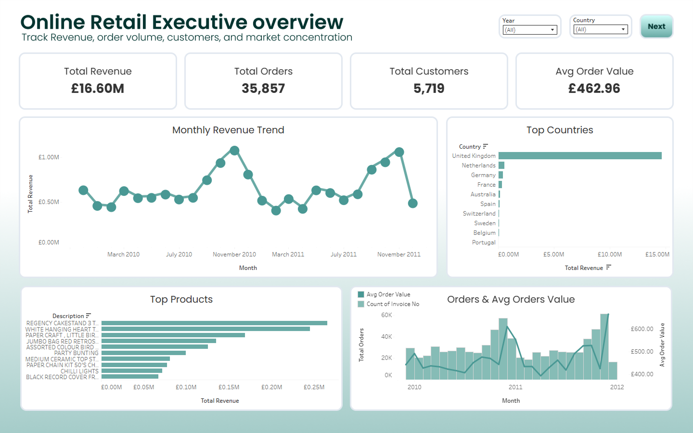
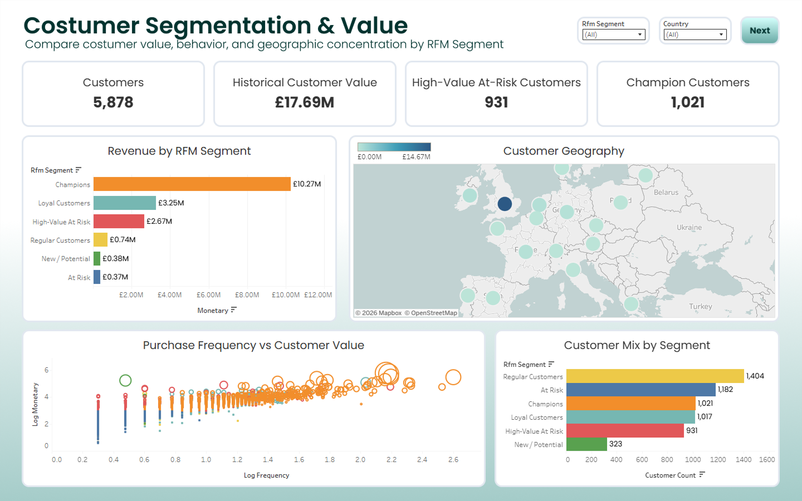
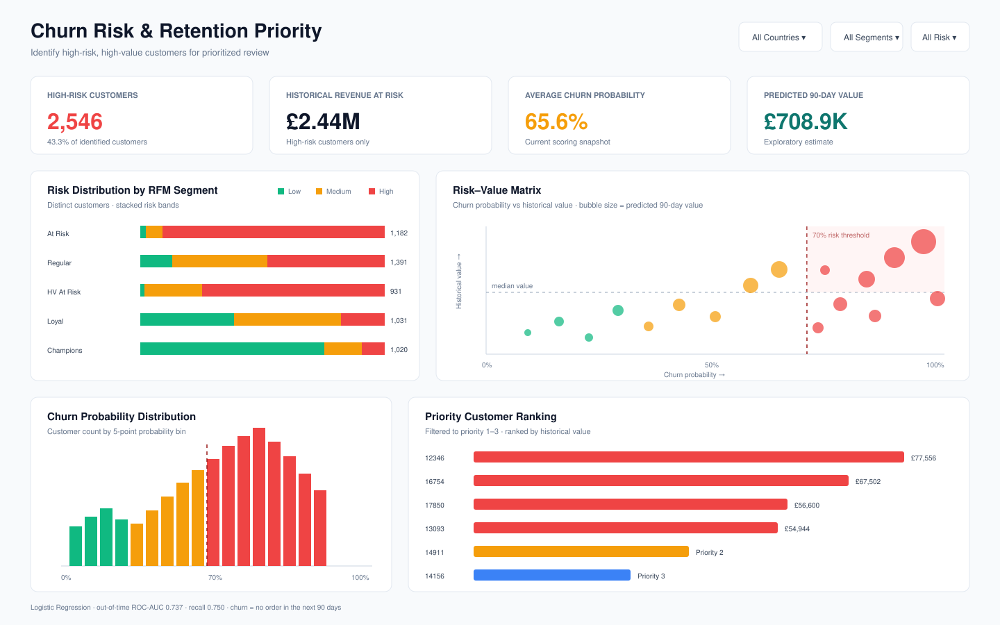
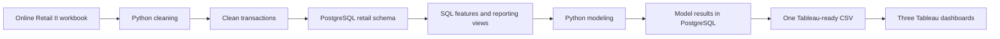

# Online Retail Customer Analytics

I built this project to analyze customer behavior in an online retail business and turn the analysis into practical retention priorities. Leveraging ChatGPT (SOL 5.6) as an AI co-pilot, I accelerated the entire development lifecycle from data exploration and SQL query optimization in PostgreSQL, to feature engineering and hyperparameter tuning for machine learning models, all the way to automating the Tableau dashboard pipeline. The project combines Python, PostgreSQL, SQL, machine learning, and Tableau into one fully reproducible, end-to-end workflow.

**Author:** Rafi Adabhi Sunarya  
**Project title:** Customer Segmentation, Churn Risk & 90-Day Value Analytics

**Tools:** Python, PostgreSQL, SQL, and Tableau
**Dataset:** UCI Online Retail II

> This project predicts customer behavior from historical transactions. It does not claim to be a production deployment or a full customer-lifetime-value system. The value model estimates customer revenue during the next 90 days.

## What I built

- Cleaned and validated more than one million raw transaction rows with Python.
- Loaded the cleaned transactions into PostgreSQL and created a dedicated `retail` schema.
- Used SQL CTEs, aggregations, `LAG`, `NTILE`, indexes, and materialized views to create customer and business features.
- Built customer-level RFM features for segmentation.
- Developed a leakage-aware temporal churn classifier and a 90-day customer-value model.
- Created a Tableau-ready dataset and designed three dashboards for executive monitoring, customer segmentation, and retention prioritization.

## Dashboard showcase

The completed dashboard previews and supporting documentation are included in [`dashboard/`](dashboard/). The three views answer different business questions:

1. **Executive Overview** — How are sales, orders, customers, countries, and products performing?
2. **Customer Segmentation & Value** — Which customer groups contribute the most value?
3. **Churn Risk & Retention Priority** — Which customers should be prioritized for retention action?

### Executive Overview



### Customer Segmentation & Value



### Churn Risk & Retention Priority



The dashboard construction details are documented in:

- [`TABLEAU_DASHBOARD_BLUEPRINT.md`](dashboard/TABLEAU_DASHBOARD_BLUEPRINT.md) — worksheet, metric, layout, and interaction design.
- [`TABLEAU_PUBLIC_MANUAL_GUIDE.md`](dashboard/TABLEAU_PUBLIC_MANUAL_GUIDE.md) — steps for connecting the final dataset and assembling the Tableau workbook.

## End-to-end workflow



PostgreSQL is a required part of the workflow after cleaning. Python does not bypass the database when it builds customer analytics or exports the dashboard dataset.

## Dataset and cleaning results

The source workbook covers online retail transactions from 1 December 2009 to 9 December 2011. I applied the following cleaning rules:

- removed exact duplicate rows;
- removed cancelled invoices and invalid transaction identifiers;
- removed rows without a customer ID;
- removed nonpositive quantities and prices;
- preserved three-decimal source prices, including valid £0.001 values;
- standardized `EIRE` to `Ireland`;
- calculated line-level revenue as `quantity × unit_price`.

| Metric | Result |
| --- | ---: |
| Raw rows | 1,067,371 |
| Clean transaction rows | 793,609 |
| Customers | 5,878 |
| Orders | 36,969 |
| Countries | 41 |
| Revenue at source precision | £17,685,460.638 |
| Revenue rounded for display | £17,685,460.64 |

## Evidence included in the repository

I include the generated results that support the figures reported in this README. These are not placeholders: they are artifacts from the completed cleaning, analysis, and modeling workflow.

| Evidence | Location | Purpose |
| --- | --- | --- |
| Clean transactions and quality report | `data/processed/` | Evidence of the cleaning result and row-level processed dataset |
| Customer analytics, model metrics, cluster profiles, and summaries | `data/outputs/` | Compact analytical evidence used to verify the reported findings |
| Trained `.joblib` models and model metadata | `models/` | Reusable artifacts from segmentation, churn classification, and 90-day value modeling |
| Dashboard previews and Tableau documentation | `dashboard/` | Evidence of the completed dashboard design and reporting layer |

The centralized `data/outputs/tableau_dashboard_dataset.csv` remains local because it is approximately 149 MB, above GitHub's 100 MB per-file limit. The dashboard previews, compact outputs, processed results, and trained models remain visible in the repository.

## Modeling approach

### Customer segmentation

I created customer-level Recency, Frequency, and Monetary features in PostgreSQL. SQL scores and business rules provide interpretable segments such as Champions, Loyal Customers, New/Potential, At Risk, and Regular Customers.

### Churn classification

I used a temporal setup instead of a random split so that future behavior does not leak into the features:

| Component | Definition |
| --- | --- |
| Observation window | 180 days of customer history |
| Prediction window | Following 90 days |
| Churn definition | No order during the following 90 days |
| Training snapshots | 1 Jun 2010 – 1 Mar 2011 |
| Validation snapshot | 1 Jun 2011 |
| Untouched test snapshot | 1 Sep 2011 |
| Selected model | Logistic Regression, selected by validation ROC-AUC |

The selected model was refit on the training and validation snapshots, then evaluated once on the untouched test snapshot.

| Test metric | Result |
| --- | ---: |
| ROC-AUC | 0.7374 |
| PR-AUC | 0.6245 |
| F1 | 0.6338 |
| Precision | 0.5487 |
| Recall | 0.7502 |

### 90-day customer value

The exploratory value model estimated revenue in the next 90 days with:

| Metric | Result |
| --- | ---: |
| MAE | £740.99 |
| RMSE | £3,737.25 |
| R² | 0.2344 |

I use this model as prioritization support, not as precise revenue forecasting.

## Technology responsibilities

| Tool | How I used it |
| --- | --- |
| Python | Workbook ingestion, cleaning, validation, feature preparation, K-Means, classification, regression, and export |
| PostgreSQL | Persistent transaction, feature, model-output, and reporting layer |
| SQL | Constraints, CTEs, RFM scoring, window functions, indexes, materialized views, and reporting views |
| Tableau | Executive performance, customer segmentation, and churn-risk dashboards |

## Repository structure

```text
online-retail-customer-analytics/
├── dashboard/
│   ├── 01_executive_overview_mockup.png
│   ├── 02_customer_segmentation_mockup.png
│   ├── 03_churn_retention_mockup.png
│   ├── TABLEAU_DASHBOARD_BLUEPRINT.md
│   └── TABLEAU_PUBLIC_MANUAL_GUIDE.md
├── data/
│   ├── raw/                  # local source workbook; excluded from Git
│   ├── processed/            # committed cleaning results and quality evidence
│   └── outputs/              # committed compact results; large Tableau CSV stays local
├── models/                   # committed trained models and metadata
├── sql/
│   ├── 01_schema.sql
│   ├── 02_analytics.sql
│   ├── 03_tableau_views.sql
│   └── 04_portfolio_queries.sql
├── src/
│   ├── 01_clean_data.py
│   ├── 02_load_postgresql.py
│   ├── 03_build_sql_features.py
│   ├── 04_model_customers.py
│   ├── 05_build_tableau_views.py
│   ├── 06_export_tableau_csv.py
│   ├── config.py
│   └── db.py
├── .env.example
├── .gitignore
├── requirements.txt
└── run_pipeline.py
```

The numbered Python modules are the execution order. The repository includes processed results, compact analytical outputs, trained model artifacts, and dashboard evidence. It excludes the raw workbook, credentials, local environments, caches, Tableau extracts, and the 149 MB centralized Tableau CSV.

## Run the project locally

### 1. Clone and create the environment

```powershell
git clone https://github.com/<your-username>/online-retail-customer-analytics.git
cd online-retail-customer-analytics

py -m venv .venv
Set-ExecutionPolicy -Scope Process -ExecutionPolicy Bypass
.\.venv\Scripts\Activate.ps1
python -m pip install --upgrade pip
pip install -r requirements.txt
```

### 2. Add the raw workbook

Download the UCI Online Retail II workbook and save it as:

```text
data/raw/online_retail_II.xlsx
```

The workbook is excluded from Git because of its size and licensing/distribution considerations.

### 3. Create the PostgreSQL database

In pgAdmin 4, create a database named `online_retail_db` with owner `postgres`. Then create a local `.env` file from the template:

```powershell
Copy-Item .env.example .env
```

Set the local PostgreSQL credentials in `.env`:

```dotenv
PGHOST=localhost
PGPORT=5432
PGDATABASE=online_retail_db
PGUSER=postgres
PGPASSWORD=YOUR_ACTUAL_POSTGRES_PASSWORD
```

The pipeline rebuilds only the project schema, `retail`. It does not drop the entire database.

### 4. Run the complete pipeline

```powershell
python run_pipeline.py
```

The script runs these six stages:

```text
01_clean_data
02_load_postgresql
03_build_sql_features
04_model_customers
05_build_tableau_views
06_export_tableau_csv
```

After a successful run, the single Tableau data source is:

```text
data/outputs/tableau_dashboard_dataset.csv
```

The export contains two clearly separated grains:

| `record_type` | Rows | Use |
| --- | ---: | --- |
| `Transaction` | 793,609 | Executive Overview |
| `Customer` | 5,878 | Segmentation and Churn dashboards |

In Tableau, filter each worksheet to the correct `record_type`. This prevents customer-level values from being repeated across transaction rows.

## Useful PostgreSQL validation

After the pipeline loads the database, I use this query in pgAdmin to verify the main transaction table:

```sql
SELECT
    COUNT(*) AS transaction_rows,
    COUNT(DISTINCT invoice_no) AS orders,
    COUNT(DISTINCT customer_id) AS customers,
    MIN(invoice_date) AS first_transaction,
    MAX(invoice_date) AS last_transaction,
    SUM(revenue) AS revenue
FROM retail.transactions;
```

The portfolio analysis queries are in [`sql/04_portfolio_queries.sql`](sql/04_portfolio_queries.sql). They cover monthly revenue, country and product performance, RFM segment contribution, churn-risk distribution, customer order gaps, and Pareto revenue concentration.

## GitHub file policy

I keep both the implementation and its result evidence visible:

- tracked: source code, SQL, README, processed data, data-quality reports, compact analysis outputs, trained models, model metadata, dashboard previews, SVGs, Tableau documentation, and authored `.twb` files;
- ignored: `.env`, virtual environments, raw workbook, Python caches, local Tableau extracts, temporary files, and `tableau_dashboard_dataset.csv` because the local file is approximately 149 MB and exceeds GitHub's 100 MB per-file limit.

This policy lets reviewers inspect the actual project results without exposing credentials or causing the GitHub push to fail on the oversized Tableau dataset.

## Limitations

- December 2011 is incomplete because the source workbook ends on 9 December.
- Churn is a behavioral proxy defined from observed purchase gaps, not an official business label.
- The 90-day value model is useful for ranking and prioritization, but its R² does not support precise individual revenue forecasting.
- The project is an offline portfolio analysis. It does not claim live, real-time, deployed, production-ready, or causal retention impact.
